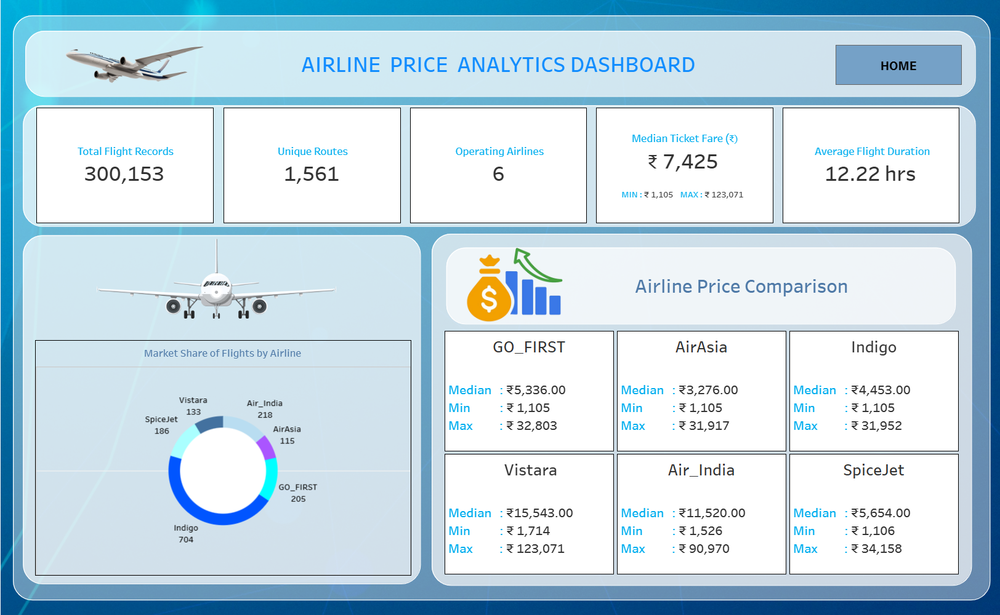
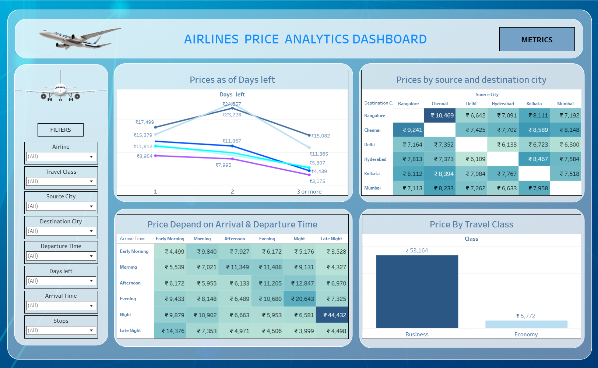

# ✈️ Airline Price Analytics Dashboard – Tableau 📊

## 📌 Project Overview

This project showcases an interactive **Airline Price Analytics Dashboard** built using **Tableau** to analyze airline ticket pricing trends across different airlines, routes, travel classes, booking timelines, and flight schedules. The dashboard helps stakeholders understand fare variation, airline-wise pricing behavior, and optimal booking patterns across major Indian cities.

**Total Flight Records Analyzed:** 300,153

---

## 🛠 Tools & Technologies

* Tableau Public
* Data Visualization
* Airline Pricing Analytics

---

## 📊 KPI Summary

Key performance indicators highlighted in the dashboard:

* **Total Flight Records:** 300,153
* **Unique Routes:** 1,561
* **Operating Airlines:** 6
* **Median Ticket Fare:** ₹7,425
* **Minimum Fare:** ₹1,105
* **Maximum Fare:** ₹123,071
* **Average Flight Duration:** 12.22 hours

---

## 📊 Dashboard Components

The dashboard consists of the following visualizations:

### 1️⃣ Line Chart – Prices as per Days Left

Displays ticket price variation based on how many days are left before departure, highlighting fare increases for last-minute bookings.

---

### 2️⃣ Heatmap – Price by Source & Destination City

Shows average ticket prices between major city pairs, helping identify high-cost and low-cost routes.

---

### 3️⃣ Heatmap – Price Dependence on Arrival & Departure Time

Analyzes how flight timing affects pricing, revealing cost-effective time slots such as early morning or late night.

---

### 4️⃣ Bar Chart – Price by Travel Class

Comparison of ticket prices between **Economy** and **Business** class, clearly showing fare gaps.

---

### 5️⃣ Airline Price Comparison Panel

Airline-wise median, minimum, and maximum fare comparison:

* **Indigo**
* **Air India**
* **Vistara**
* **GO_FIRST**
* **AirAsia**
* **SpiceJet**

---

### 6️⃣ Donut Chart – Market Share of Flights by Airline

Shows airline-wise distribution of total flights, indicating market dominance and competition.

---

## 🎯 Key Insights

* Ticket prices generally increase as departure date approaches
* **Economy class** fares are significantly lower than **Business class**
* Certain city routes consistently show higher average prices
* Indigo dominates flight volume, while premium airlines show higher fare ranges
* Flight arrival and departure timing plays a major role in price optimization

---

## 🔍 Filters & Interactivity

* Airline Filter
* Travel Class Filter
* Source City Filter
* Destination City Filter
* Departure Time Filter
* Arrival Time Filter
* Days Left Filter
* Stops Filter

All visuals are dynamically connected for interactive exploration.

---

## 🖼 Dashboard Preview

### Metrics View:

### Home View:

---

## 🔗 Live Dashboard

View the interactive dashboard on Tableau Public:
👉 [**Tableau Public Dashboard Link**](https://public.tableau.com/app/profile/sagar.singh7536/viz/AirlinesPricePredictionAnalysis_17670276322940/HOME)

---

## 📁 Repository Contents

* `Airline_Price_Analytics_Dashboard.twbx` – Tableau packaged workbook
* `Airline_Price_Analytics_image2.png` – Home view image
* `Airline_Price_Analytics_image1.png` – Metrics view image
* `README.md` – Project documentation

---
