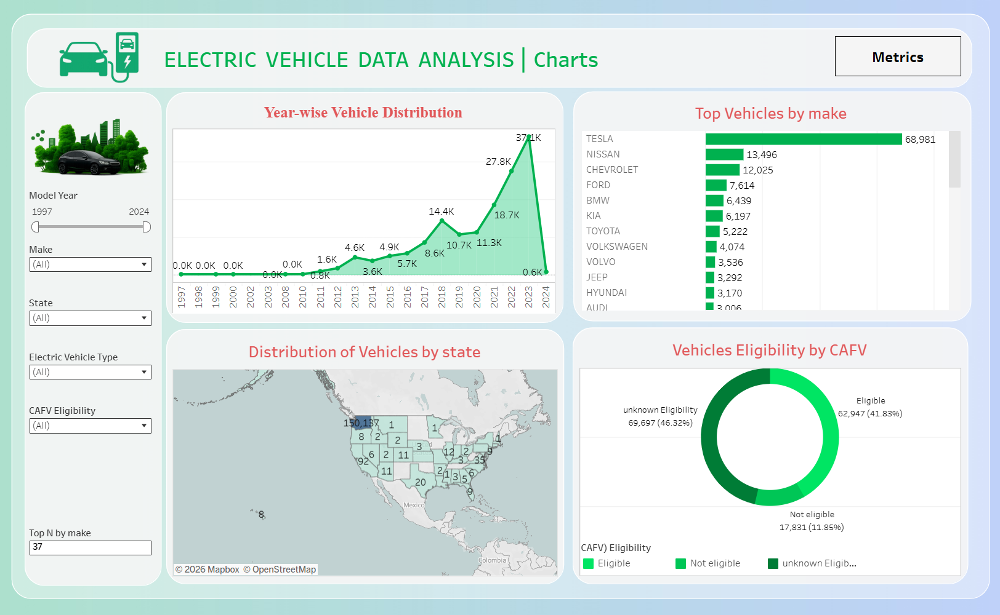
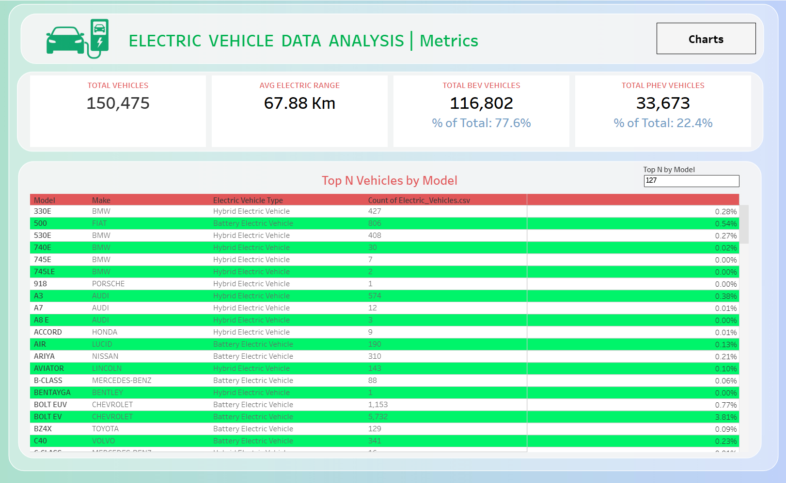

# Electric Vehicle Data Analysis Dashboard – Tableau 📊

📌 Project Overview  
This project showcases an interactive Electric Vehicle (EV) Data Analysis Dashboard built using Tableau to analyze electric vehicle trends, top models, regional distribution, and CAFV eligibility. The dashboard helps stakeholders understand EV adoption, manufacturer trends, vehicle types, and incentive eligibility across different states.

Time Period Covered: 1997 – 2024  
Total Vehicles Analyzed: 150,475  

---

🛠 Tools & Technologies
- Tableau Public
- Data Visualization
- Electric Vehicle Analytics

---

📊 KPI Summary  
Key performance indicators highlighted in the dashboard:

- Total Vehicles: 150,475  
- Average Electric Range: 67.88 Km  
- Total BEV Vehicles: 116,802 (77.6%)  
- Total PHEV Vehicles: 33,673 (22.4%)  

---

📊 Dashboard Components  
The dashboard consists of the following visualizations:

1️⃣ **Line / Area Chart – Year-wise Vehicle Distribution**  
Displays EV adoption trends from 1997 to 2024, highlighting growth in BEV and PHEV registrations.

2️⃣ **Bar Chart – Top Vehicles by Make**  
Top manufacturers by vehicle count:

- TESLA: 68,981  
- NISSAN: 13,496  
- CHEVROLET: 12,025  
- FORD: 7,614  
- BMW: 6,439  
- KIA: 6,197  

3️⃣ **Map – Distribution of Vehicles by State**  
Choropleth map showing EV distribution across states, helping identify high-adoption regions.

4️⃣ **Donut Chart – Vehicles Eligibility by CAFV**  
Eligibility breakdown for CAFV incentives:

- Eligible: 62,947 (41.83%)  
- Not Eligible: 17,831 (11.85%)  
- Unknown: 69,697 (46.32%)  

5️⃣ **Table – Top N Vehicles by Model**  
Detailed table of EV models including make, type (BEV / PHEV / Hybrid), and count, allowing model-level analysis.

---

🎯 Key Insights  
- TESLA leads the EV market with 68,981 vehicles  
- BEVs constitute 77.6% of total EVs, PHEVs 22.4%  
- Average electric range across all vehicles is 67.88 Km  
- Nearly 42% of vehicles are eligible for CAFV incentives  

---

🔍 Filters & Interactivity  
- **Year Filter:** Analyze trends for specific model years  
- **Make Filter:** Focus on specific manufacturers  
- **State Filter:** Explore regional adoption trends  
- **Electric Vehicle Type Filter:** BEV, PHEV, Hybrid  
- **CAFV Eligibility Filter:** Eligible, Not Eligible, Unknown  
All visuals are dynamically connected for interactive exploration

---

🖼 Dashboard Preview  
Charts View:  
  

Metrics View:  
  

---

🔗 Live Dashboard  
View the interactive dashboard on Tableau Public: 👉 https://public.tableau.com/app/profile/sagar.singh7536/viz/ElectricVehicleDataAnalysis_17677205122230/Charts  

---

📁 Repository Contents  
- `Electric_Vehicle_Dashboard.twbx` – Tableau packaged workbook  
- `Electric_Vehicle_Dashboard_image1.png` – Charts view image  
- `Electric_Vehicle_Dashboard_image2.png` – Metrics view image  
- `README.md` – Project documentation
