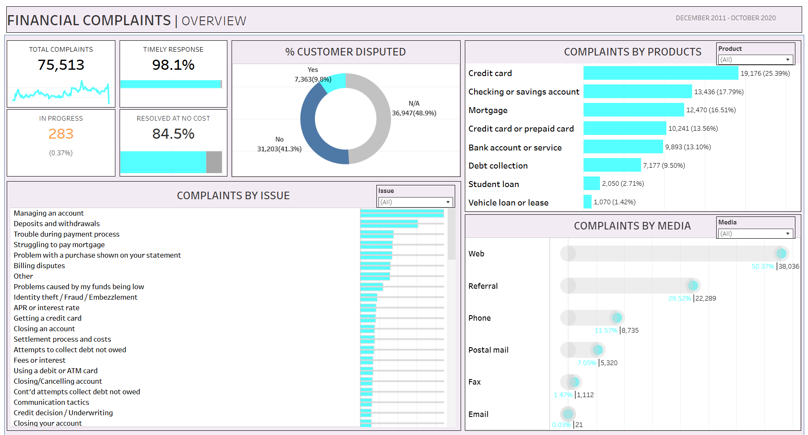

# Financial Complaints Dashboard – Tableau 📊

## 📌 Project Overview

This project showcases an **interactive Financial Complaints Dashboard** built using **Tableau** to analyze consumer complaints related to financial products and services.
The dashboard helps stakeholders understand complaint volume, response efficiency, dispute behavior, and trends across products, issues, and communication channels.

**Time Period Covered:** December 2011 – October 2020
**Total Complaints Analyzed:** 75,513

---

## 🛠 Tools & Technologies

* Tableau Public
* Data Visualization
* Financial & Consumer Complaints Analytics

---

## 📊 KPI Summary

Key performance indicators highlighted in the dashboard:

* **Total Complaints:** 75,513
* **Timely Response Rate:** 98.1%
* **Resolved at No Cost:** 84.5%
* **Complaints In Progress:** 283 (0.37%)

---

## 📊 Dashboard Components

The dashboard consists of the following visualizations:

### 1️⃣ Donut Chart – Customer Dispute Status

* **Disputed:** 7,363 (9.8%)
* **Not Disputed:** 31,203 (41.3%)
* **N/A:** 36,947 (48.9%)

Helps understand customer escalation behavior.

---

### 2️⃣ Bar Chart – Complaints by Product

Top products by complaint volume:

* **Credit Card:** 19,176 (25.39%)
* **Checking or Savings Account:** 13,436 (17.79%)
* **Mortgage:** 12,470 (16.51%)
* **Credit Card / Prepaid Card:** 10,241 (13.56%)
* **Bank Account or Service:** 9,893 (13.10%)

---

### 3️⃣ Bar Chart – Complaints by Issue

Most frequent complaint issues include:

* Managing an account
* Deposits and withdrawals
* Trouble during payment process
* Mortgage payment difficulties
* Billing disputes

(Each issue contributes thousands of complaints, highlighting operational pain points.)

---

### 4️⃣ Bubble / Dot Chart – Complaints by Submission Channel

* **Web:** 38,036 (50.37%)
* **Referral:** 22,289 (29.52%)
* **Phone:** 8,735 (11.57%)
* **Postal Mail:** 5,320 (7.05%)
* **Fax:** 1,112 (1.47%)
* **Email:** 21 (0.03%)

---

## 🎯 Key Insights

* **Credit cards alone account for 19,176 complaints (25.39%)**, making them the highest-risk product
* **74,070 complaints (98.1%)** received a timely response
* **63,796 complaints (84.5%)** were resolved without any monetary cost
* **Web-based submissions dominate with 38,036 complaints (50.37%)**
* Only **7,363 complaints (9.8%)** resulted in customer disputes

---

## 🔍 Filters & Interactivity

* **Product Filter:** Analyze complaints by specific financial products
* **Issue Filter:** Drill down into detailed complaint categories
* **Media Filter:** Explore complaint trends by submission channel
* All visuals are dynamically connected for interactive analysis

---

## 🖼 Dashboard Preview

---

## 🔗 Live Dashboard

View the interactive dashboard on Tableau Public:
👉 [**Tableau Public Dashboard Link**](https://public.tableau.com/app/profile/sagar.singh7536/viz/FinancialDashboard_17649326371380/Dashboard1)

## 📁 Repository Contents

* `Financial_Complaints_Dashboard.twbx` – Tableau packaged workbook
* `financial_complaints_dashboard.png` – Dashboard image preview
* `README.md` – Project documentation

---

