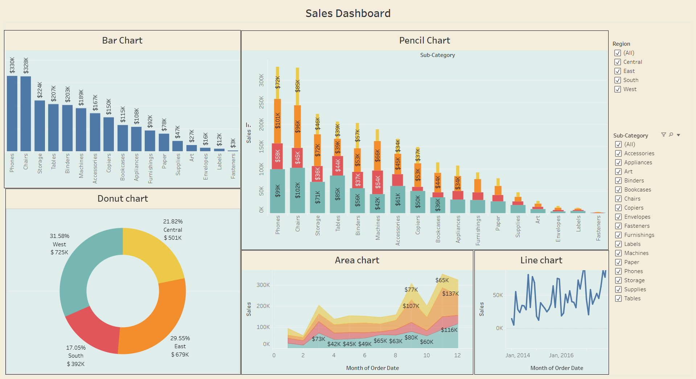

# 📊 Sales Dashboard – Tableau

## 📌 Project Overview
This project showcases an interactive **Sales Dashboard** built using **Tableau** to analyze sales performance across different regions, product categories, and time periods.  
The dashboard helps stakeholders quickly identify top-performing products, regional contributions, and sales trends.

---

## 🛠 Tools & Technologies
- Tableau Public
- Data Visualization
- Sales Analytics

---

## 📊 Dashboard Components
The dashboard consists of the following visualizations:

### 1️⃣ Bar Chart – Sales by Category
- Displays total sales for each product category
- Helps identify top and low-performing categories

### 2️⃣ Stacked (Pencil) Chart – Sales by Sub-Category & Region
- Shows sales distribution across sub-categories
- Region-wise contribution is clearly visible using stacked bars

### 3️⃣ Donut Chart – Regional Sales Contribution
- Visualizes percentage and total sales by region
- Highlights which region contributes the most to overall sales

### 4️⃣ Area Chart – Monthly Sales Trend by Region
- Displays how sales change over months
- Useful for identifying seasonal patterns and growth periods

### 5️⃣ Line Chart – Overall Sales Trend
- Shows overall sales trend over time
- Helps analyze fluctuations and long-term movement

---

## 🎯 Key Insights
- **West region** contributes the highest share of total sales
- **Phones and Chairs** are the top-performing categories
- Sales show a noticeable **increase towards the end of the year**
- **Office Supplies** categories contribute less revenue compared to Technology

---

## 🔍 Filters & Interactivity
- **Region Filter**: Central, East, South, West
- **Sub-Category Filter**: Allows detailed drill-down analysis
- All charts are dynamically linked for interactive exploration

---

## 🖼 Dashboard Preview

---

## 🔗 Live Dashboard
View the interactive dashboard on Tableau Public:  
👉 **[Tableau Public Dashboard Link](https://public.tableau.com/views/SalesPracticeDashboard_17645992533120/SalesDashboard?:language=en-US&:sid=&:redirect=auth&:display_count=n&:origin=viz_share_link)**

---

## 📁 Repository Contents
- `Sales_Dashboard.twbx` – Tableau packaged workbook
- `sales_dashboard.png` – Dashboard image preview
- `README.md` – Project documentation

